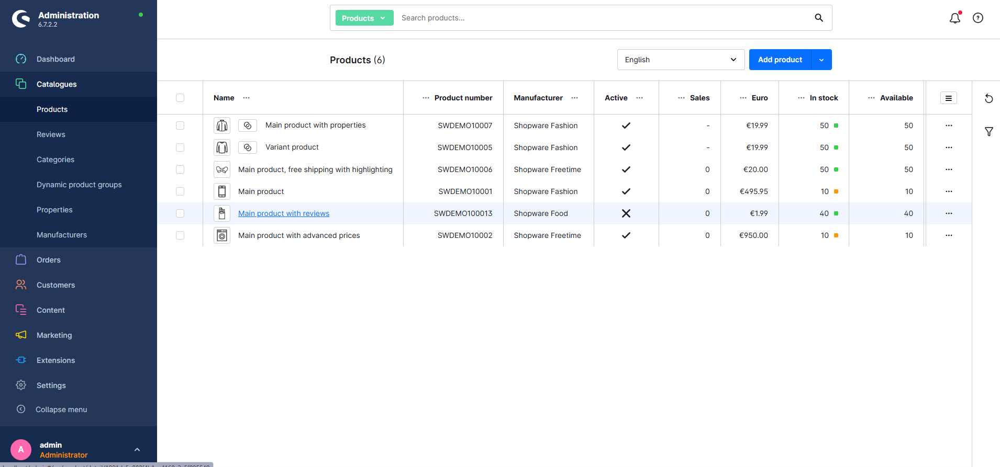
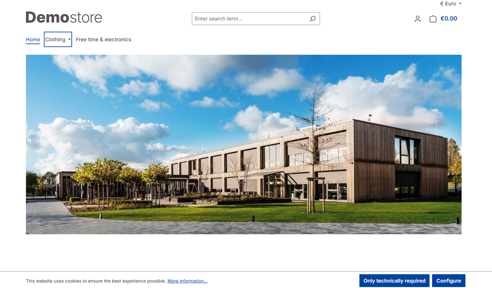

# Модуль "Альтернативные описания товаров" для Shopware 6

# 1. Назначение

Этот модуль расширяет стандартные возможности Shopware 6, позволяя задавать уникальные описания для товаров в зависимости от **канала продаж** и **языка**.

Это полезно для:
- Адаптации маркетинговых текстов под разные аудитории (например, B2B и B2C).
- SEO-оптимизации с использованием разных ключевых слов для разных витрин.
- Предоставления специфической информации о товаре для конкретного региона или страны.

Если альтернативное описание не задано, используется стандартное описание товара (fallback).

# 2. Системные требования

- **Shopware**: 6.6.x или выше
- **PHP**: 8.2 или выше
- **Docker** и **Docker Compose** (для локальной разработки)

# 3. Установка

1.  **Скачайте** архив с плагином или клонируйте репозиторий.
2.  **Распакуйте/скопируйте** содержимое в директорию `custom/plugins/` вашего Shopware-магазина. Имя директории должно быть `MultiDescribe`.
3.  **Подключитесь** к консоли вашего сервера/контейнера.
4.  **Выполните команды** для установки и активации плагина:
    ```bash
    bin/console plugin:refresh
    bin/console plugin:install --activate MultiDescribe
    bin/console cache:clear
    ```
5.  **Пересоберите админ-панель**, чтобы изменения в интерфейсе применились:
    ```bash
    bin/build-administration.sh
    ```

# 4. Использование

1.  Перейдите в админ-панель: `Каталоги -> Товары`.
2.  Откройте любой товар для редактирования.
3.  Найдите новую вкладку **"Descriptions"** ("Описания").
4.  Внутри вы увидите вкладки для каждого активного канала продаж.
5.  Для каждого канала продаж будут доступны текстовые редакторы для всех языков, настроенных в системе.
6.  Заполните нужные описания и сохраните товар.
7.  На витрине магазина, в соответствующем канале продаж и с выбранным языком, вы увидите новое описание.

# 5. Локальная разработка

В корне проекта находится файл `docker-compose.yml` для быстрого запуска готового окружения.

1.  Убедитесь, что Docker запущен.
2.  Выполните команду:
    ```bash
    docker-compose up -d
    ```
3.  Дождитесь запуска контейнера. Shopware будет доступен по адресу `http://localhost`.
4.  Админ-панель: `http://localhost/admin`
    -   **Логин**: `admin`
    -   **Пароль**: `shopware`
5.  Директория с плагином (`MultiDescribe`) уже будет смонтирована в контейнер по пути `/var/www/html/custom/plugins/MultiDescribe`. Все изменения, которые вы делаете локально, сразу же применяются внутри контейнера.

# Используемые технологии

| Frontend | State Management | Validation | UI / Components | Backend | Language | API & Tools |
|---|---|---|---|---|---|---|
|     |  |   |    |  |  |    |

# 6. Скриншоты

# Админ-панель


# Витрина магазина

